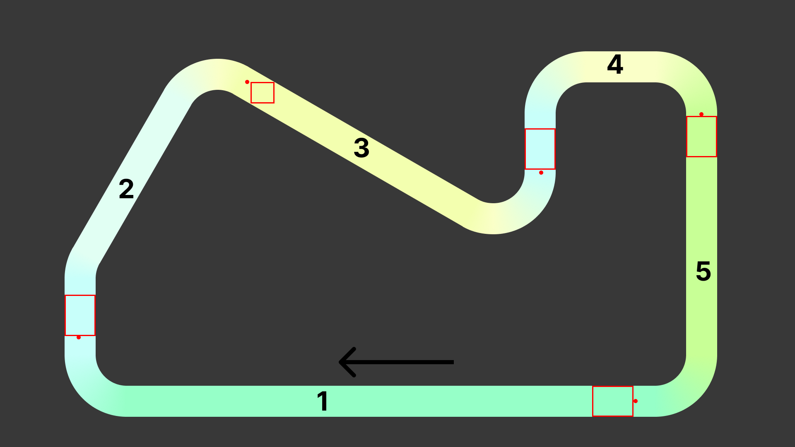

# SIU Projekt - Etap 1 - Zespół 3
- Konrad Wojda
- Mikołaj Kuranowski
- Mateusz Brzozowski
- Bartłomiej Krawczyk

# Tor
Stworzony tor inspirowany jest uproszczoną nitką toru [Circuit de Barcelona-Catalunya](https://pl.wikipedia.org/wiki/Circuit_de_Barcelona-Catalunya). Zawiera on wyoblone zakręty o różnych kątach.  

# Scenariusze
Stworzyliśmy różnorodne scenariusze, aby żółwie nauczyły się pokonywać każdy z zakrętów na torze. Pole startowe znajduje się na prostej, a cel - za najbliższym zakrętem. Poniżej przygotowana została wizualizacja pokazująca prostokąty, z których żółwie startują oraz punkty celu.

## Plik CSV
id|liczba agentów|start (lewo, m)|start (prawo, m)|start (dół, m)|start (góra, m)|cel x| cel y 
-|-|-|-|-|-|-|-
1|1|65|69.54545455|3.318181818|6.727272727|8.636363636|12.04545455
2|1|7.090909091|10.5|12.18181818|16.72727273|27.13636364|40.09090909
3|1|27.5|30.13636364|37.72727273|40.09090909|59.40909091|30.13636364
4|1|57.59090909|61|30.45454545|35|77|36.54545455
5|1|75.31818182|78.72727273|31.81818182|36.36363636|69.77272727|5.045454545

## Wizualizacja

