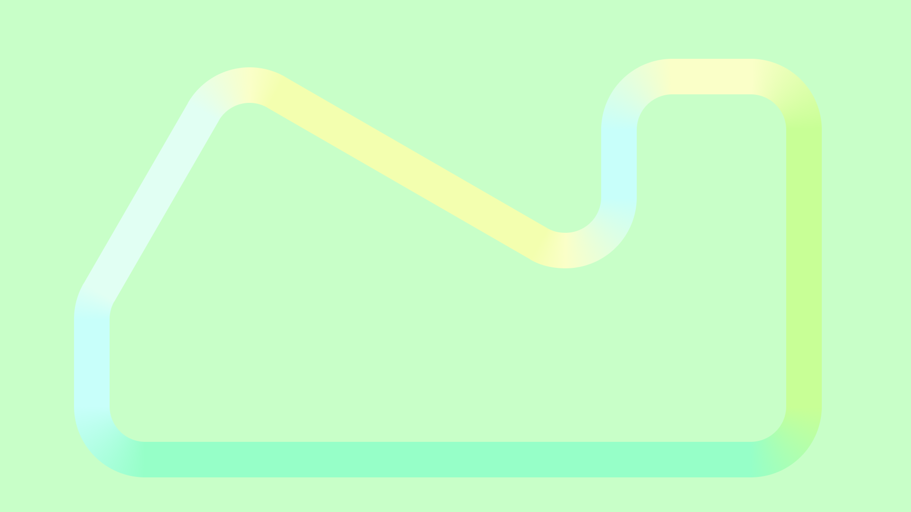
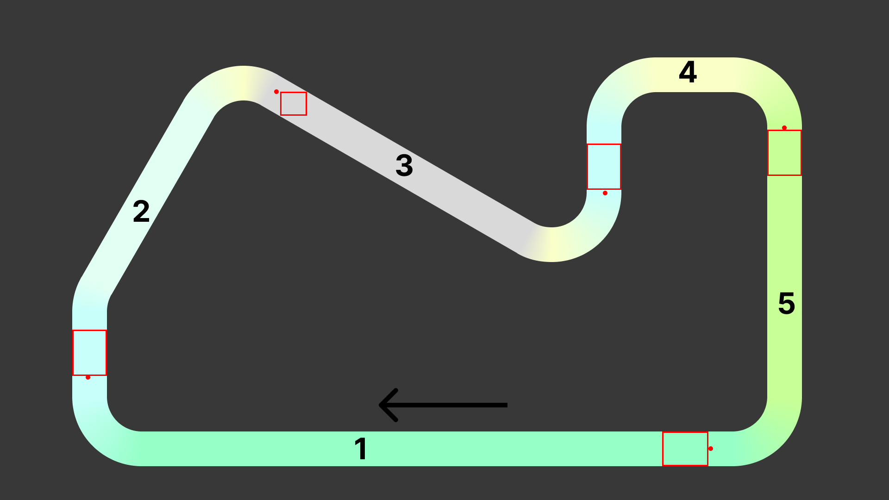

# SIU Projekt - Etap 1 - Zespół 3
- Konrad Wojda
- Mikołaj Kuranowski
- Mateusz Brzozowski
- Bartłomiej Krawczyk

# Tor
Stworzony tor inspirowany jest uproszczoną nitką toru [Circuit de Barcelona-Catalunya](https://pl.wikipedia.org/wiki/Circuit_de_Barcelona-Catalunya). Zawiera on wyoblone zakręty o różnych kątach.  



# Scenariusze
Scenariusze zostały stworzone w taki sposób, aby żółwie nauczyły się pokonywać każdy z zakrętów na torze. Pole startowe znajduje się na prostej, a cel - za najbliższym zakrętem. Poniżej przygotowana została wizualizacja pokazująca prostokąty, z których żółwie startują oraz punkty celu.
## Plik CSV
```csv
id,agents_no,start_left,start_right,start_bottom,start_top,goal_x,goal_y
1,1,1430,1530,1007,932,190,815
2,1,156,231,812,712,597,198
3,1,605,663,250,198,1307,417
4,1,1267,1342,410,310,1694,276
5,1,1657,1732,380,280,1535,969
```
## Wizualizacja

